# HOMEWORK 3 AREP (Taller Clientes y Servicios)


This workshop presents different challenges that will help you explore the concepts of naming schemes and clients and services. In addition, the workshop will help you explore the architecture of applications distributed over the Internet.

# DOCUMENTATION

[Tarea 3 - Arep (LaTeX)](/Tarea3Arep.pdf)

# DESIGN CHALLENGE 1

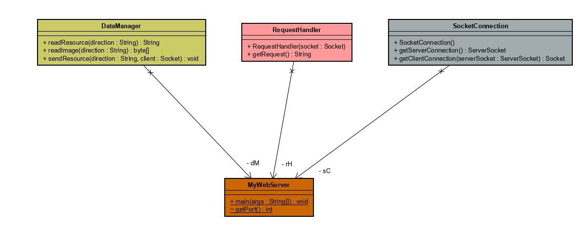

## DataManager

readResource -->     * @param direction Name of the file, without path.
    		     * @return file, html file.

readImage -->        * @param direction name of the image that you need to read.
    		     * @return finalData, image in byte array.

sendResource -->     * @param direction name of the resource that server needs to send.
		     * @param client Client Socket to know where to send the resource.

## RequestHandler

RequestHandler -->   * @param socket this is the socket that the RequestHandler needs to review request.
    		     * @return finalResource the name of the file that client needs.

getRequest --> 	     * @return name of the request made by the client throught GET petitions.


## SocketConnection

getServerConnection -->  * @return socket server

getClientConnection -->  * @param serverSocket he client will connect to this server. 
    			 * @return clientSocket clientSocket Socket del cliente.


# DESIGN CHALLENGE 2

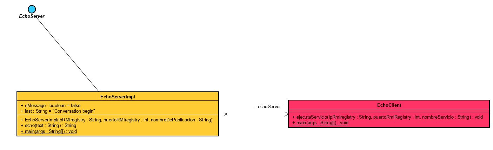

### EchoClient

ejecutaServicio --> run the service.

echo --> echo server implementation

### EchoServer (Interface)


# START

Copy the project through git clone in any direction to start working:
```
https://github.com/Juaco9502/Taller-Clientes-y-Servicios---AREP.git
```

## PRE-REQUISITES

* Java jdk > 7
* Maven (Apache Maven)
* Git

## INSTALL

1. Run in terminal:

```
$$ mvn package
```
2.(Optional):
If you want to view the documentation of the application, execute the following command and check the following path: root / target / site / apidocs:

```
mvn javadoc:javadoc
```

3. (Run):

# EXERCISE 1

Write a program in which you create a URL object and print each of the components of a URL to the screen. That is, you must use the following methods: getProtocol, getAuthority, getHost, getPort, getPath, getQuery, getFile, getRef. Make sure neither prints an empty string, this implies that the URL you use for your object must contain enough data.
  
```
java -cp target/TallerClientesServicios-1.0-SNAPSHOT.jar co.edu.escuelaing.arep.taller3.ejercicio1.analizadorUrl

```
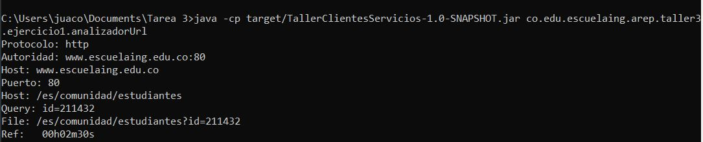

# EXERCISE 2

Write a browser application that, given a URL, reads data from that address and stores it in a file with the name result.html. Try to view this file in the browser. Your implementation must be a program that receives the URL parameter via the command line.
  
```
java -cp target/TallerClientesServicios-1.0-SNAPSHOT.jar co.edu.escuelaing.arep.taller3.ejercicio2.URLReader

```

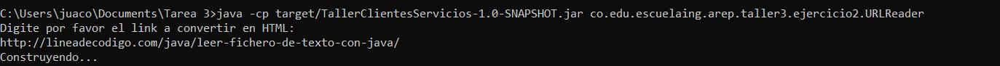

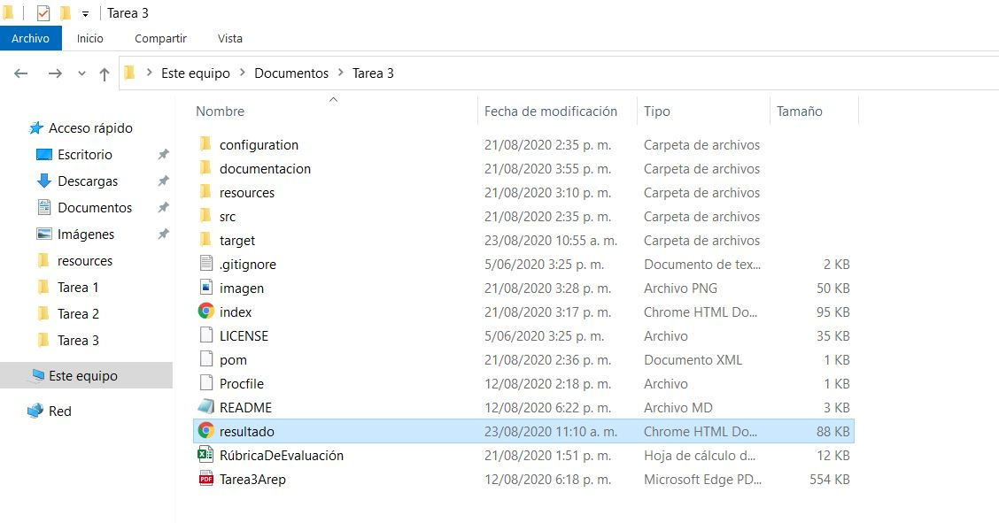

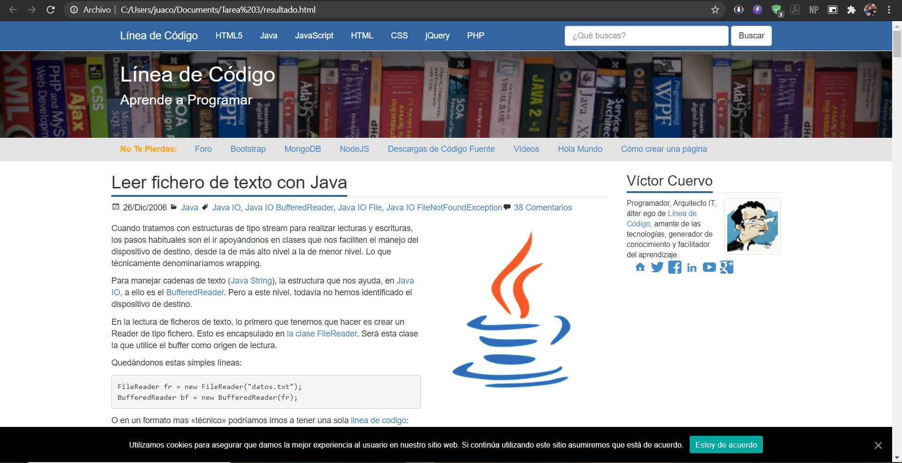


# EXERCISE 3

Using sockets write a server that receives a number and answers the square of this number. Write a customer to test it and send him a sequence of 20 numbers.
  

Power on the server:
```
java -cp target/TallerClientesServicios-1.0-SNAPSHOT.jar co.edu.escuelaing.arep.taller3.ejercicio3.MultiplyServer

```


Request the numberd
```
java -cp target/TallerClientesServicios-1.0-SNAPSHOT.jar co.edu.escuelaing.arep.taller3.ejercicio3.EchoClient

```

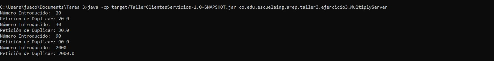

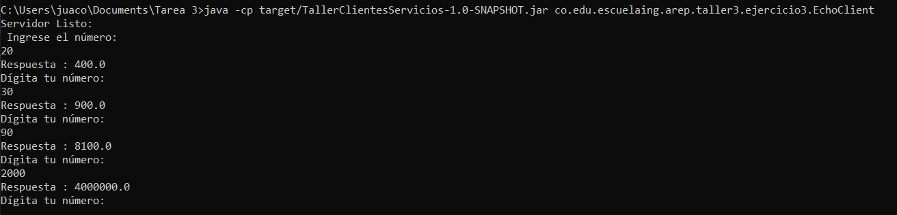


# CHALLENGE 1

Write a web server that supports multiple requests in a row (non-concurrent). The server should return all requested files, including html pages and images. Build a website with javascript to test your server. Deploy your solution on Heroku. DO NOT use web frameworks like Spark or Spring use only Java and the libraries for network management.
  
```
java -cp target/TallerClientesServicios-1.0-SNAPSHOT.jar co.edu.escuelaing.arep.taller3.reto1.MyWebServer

```

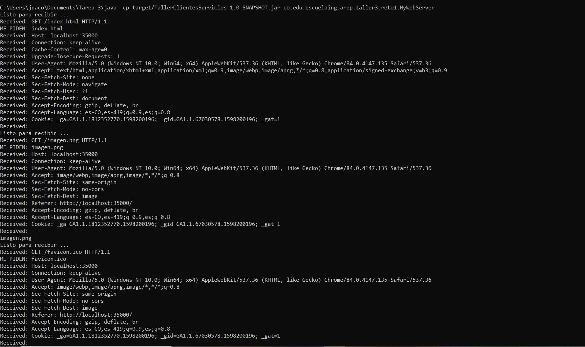

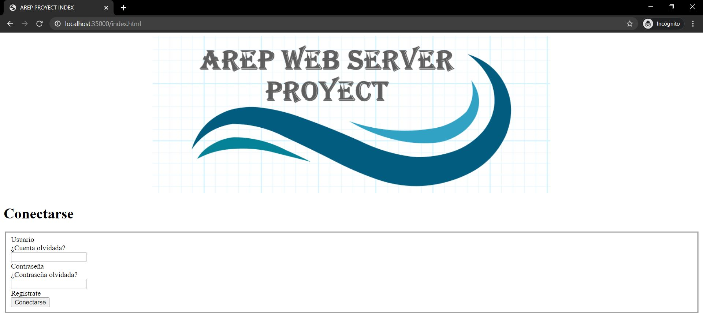


# CHALLENGE 2

Using your server and java (DO NOT use web frameworks like Spark or Spring). Write a Spark-like framework that allows you to publish "get" web services with lambda functions and allows you to access static resources such as pages, javascripts, images, and CSSs. Create an application that connects to a database from the server to test your solution. Deploy your solution on Heroku.
  
```
java -cp target/TallerClientesServicios-1.0-SNAPSHOT.jar co.edu.escuelaing.arep.taller3.reto2.EchoClient

```

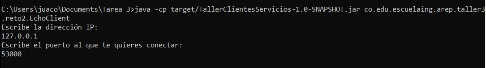


## HEROKU
[tarea3-arep](https://tarea3-arep.herokuapp.com/) - Link HEROKU

## BUILT

* [Maven](https://maven.apache.org/) - Dependency Management
* [JAVA JDK 8](http://www.oracle.com/technetwork/java/javase/overview/index.html) - Building
* [JUnit 3.8.1](https://mvnrepository.com/artifact/junit/junit/3.8.1) - Test


## AUTHOR

* **JUAN CAMILO ORTIZ MEDINA** - [Juaco9502](https://github.com/juaco9502)


## LICENSE

This project is licensed under the GNU General Public License - [LICENSE](LICENSE) 